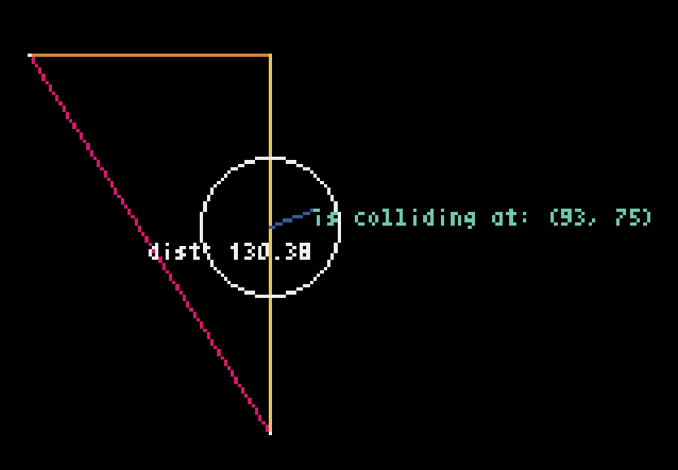

# Trigonometria

Learning trigonometria by doing and visualizing functions
and shapes :) with pyxel.


### How to run the project.
To run this project you need to

1) create a python `environment` by executing this:
  * `python3 -m venv venv`

2) install the following dependencies
  * `pip install pyxel`

Now you can run this command:
`pyxel run main.py`


### What I learned by doing.


#### Things I learn doing this.
- I learn how to draw in pyxel xD
- Calculate the distance by doing the `pitagorazo xD` here is the formula I use to do that.
$$c = \sqrt{a^2 + b^2}$$
- I learn to calculate the colitions on circles an a point in this case the point was my mouse :).

	- first we need $$\Delta x$$ and $$\Delta y$$
	
	- $$\Delta x = x_f - x_i $$
	- $$\Delta y = y_f - y_i $$
	- Once we have that we can check if those points colide with the radius of the circle by doing this.
	- $$\Delta x^2 + \Delta y^2 \leq r^2 $$
	- And the code looks like this.
	
```python
    def distance_sq(self, p1, p2):
        x1, y1 = p1
        x2, y2 = p2

        dx = x2 - x1
        dy = y2 - y1

        return dx * dx + dy * dy

    def is_inside_circle(self, center, point, radius):
        return self.distance_sq(center, point) <= radius * radius
```

I learn much doing this project and I'll continue adding more things like the chaos mode :D